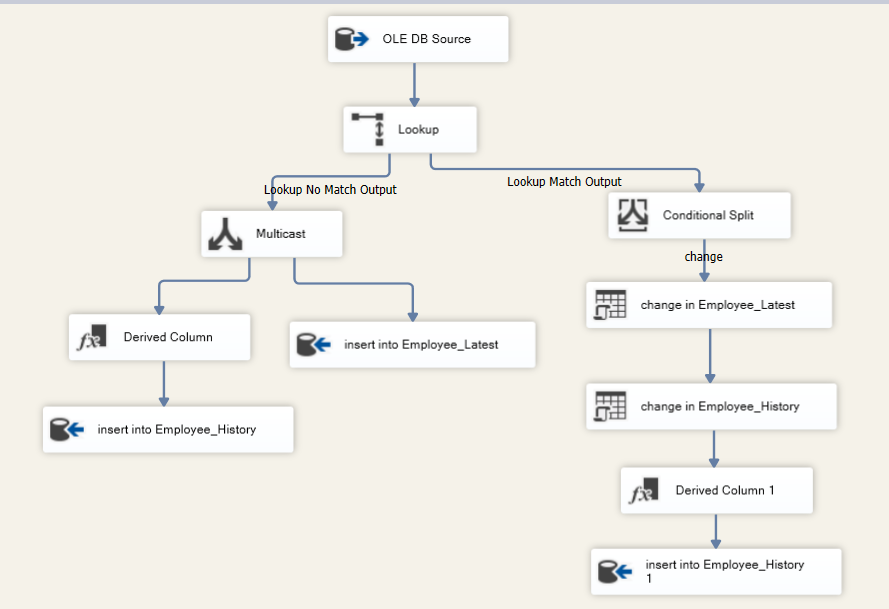
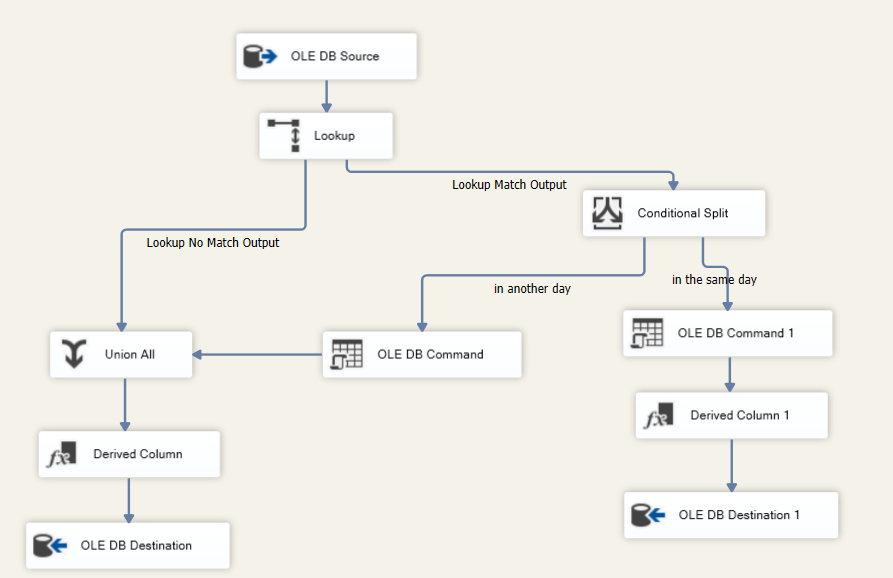
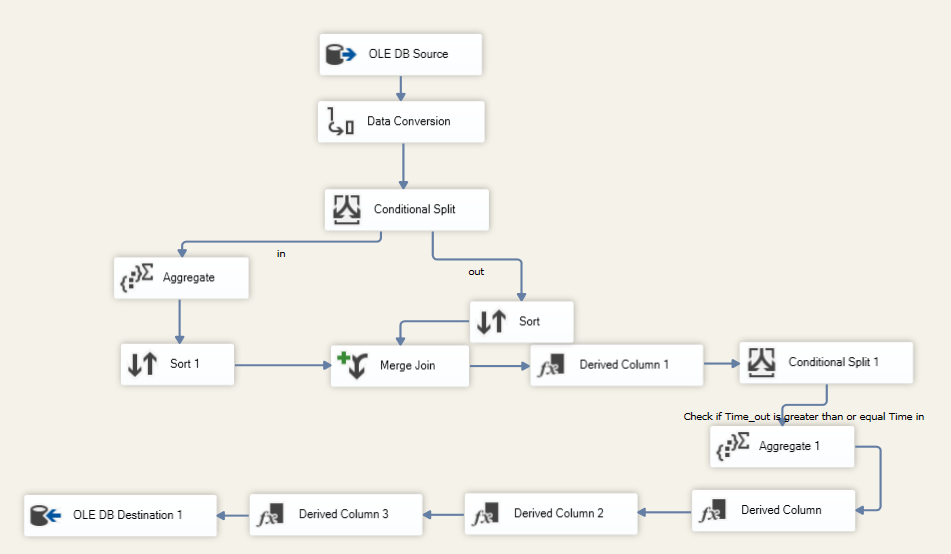

# ETL Pipeline with Microsoft SSIS

This project demonstrates how to create an ETL (Extract, Transform, Load) pipeline using Microsoft SQL Server Integration Services (SSIS). The pipeline addresses four different data integration problems using SSIS.

## Table of Contents

1. [Introduction](#introduction)
2. [Problem 1: Consuming a REST API](#problem-1-consuming-a-rest-api)
    - [Problem Statement](#problem-statement)
    - [Solution](#solution)
    - [Step-by-Step Implementation](#step-by-step-implementation)
        - [Set Up SSIS Package](#set-up-ssis-package)
        - [C# Code Explanation](#c-code-explanation)
3. [Problem 2: Implementing SCD Type 4 with Incremental Load](#problem-2-implementing-scd-type-4-with-incremental-load)
    - [Problem Statement](#problem-statement-1)
    - [Solution](#solution-1)
    - [Step-by-Step Implementation](#step-by-step-implementation-1)
    - [SSIS Package Screenshot](#ssis-package-screenshot)
4. [Problem 3: Load Source Data to a Target Table Using Versioning](#problem-3-load-source-data-to-a-target-table-using-versioning)
    - [Problem Statement](#problem-statement-2)
    - [Solution](#solution-2)
    - [Step-by-Step Implementation](#step-by-step-implementation-2)
    - [Screenshot](#screenshot)
5. [Problem 4: Attendance Device Data Integration](#problem-4-attendance-device-data-integration)
    - [Problem Statement](#problem-statement-3)
    - [Solution](#solution-3)
    - [Step-by-Step Implementation](#step-by-step-implementation-3)
    - [Screenshot](#screenshot-1)
6. [Conclusion](#conclusion)

---

## Introduction

This project demonstrates various ETL tasks using Microsoft SSIS. Each problem focuses on a different aspect of data integration, utilizing SSIS to solve these tasks efficiently.

---

## Problem 1: Consuming a REST API

### Problem Statement

Consume any REST API and load the response to the database. You don’t have to load all the response fields; 3 or 4 is sufficient. For this example, we use a REST API that searches for universities. We create a database table named `University` with three columns: `name`, `country`, and `alpha_two_code`, and load those fields only.

### Solution

To solve this problem, we use a Script Task in SSIS and write a C# script to consume the REST API, extract the necessary fields, and load the data into the SQL Server database.

### Step-by-Step Implementation

#### Set Up SSIS Package

Create a new SSIS package and add a Script Task; then click "Edit Script" to configure the C# script.

#### C# Code Explanation

The script starts by setting up namespaces and defining the `College` class, which maps to the structure of the JSON response from the API. It then configures security protocols for web requests and makes a request to the API URL `http://universities.hipolabs.com/search`. The JSON response is deserialized into a list of `College` objects. For each `College` object, the script connects to the SQL Server database and inserts the data into the `University` table. If an error occurs, it logs the error to a file.

---

## Problem 2: Implementing SCD Type 4 with Incremental Load

### Problem Statement

Implement SCD type 4 for the `Employee_Q2` source table, with fields City and Email, and read the source data using incremental load.

### Solution

To implement SCD Type 4 and incremental load, we'll create two target tables: `Employee_Latest` and `Employee_History`. These tables will store the latest version and history of changes for each employee.

### Step-by-Step Implementation

1. **Create Target Tables:**
   - **Employee_Latest:** ID, Name, City, Email, Update_Date (datetime).
   - **Employee_History:** History_ID, ID, Name, City, Email, Update_Date (datetime), End_Date (datetime).

2. **SSIS Package Overview:**
   - Extract data from `Employee_Q2`.
   - Use Lookup Transformation to match data with `Employee_Latest`.
   - Split data into new and updated records.
   - Set `Update_Date` and manage historical changes.
   - Insert new records into `Employee_Latest` and update `Employee_History`.

3. **Explanation:**
   - **Incremental Load:** Efficiently processes new and updated data.
   - **SCD Type 4 Handling:** Maintains current and historical data for each employee.
   - **SSIS Components:** Utilizes Lookup Transformation, Conditional Split, Derived Column, and OLE DB Command.

#### SSIS Package Screenshot

---

## Problem 3: Load Source Data to a Target Table Using Versioning

### Problem Statement

Load data from the `Employee_Q3` source table into a target table with versioning, as described below.

### Solution

The solution involves using SSIS to implement a versioning strategy for loading data from the source table `Employee_Q3` to a target table. This versioning strategy includes inserting new versions of records on the same day and closing all previous versions. On the next day, a new version starts from 1.

### Step-by-Step Implementation

1. **Create Target Table:**
   - **Target_Table:** Emp_Key, ID, Name, City, Email, Insert_Date, Active_Flag, Version_No.

2. **SSIS Package Overview:**
   - **OLE DB Source:** Extracts data from `Employee_Q3`.
   - **Lookup Transformation:** Matches data with existing records in the target table based on ID.
     - **Lookup No Match Output:** Handles new records.
     - **Lookup Match Output:** Handles existing records.
   - **Conditional Split:**
     - **In the Same Day:** Routes data for processing on the same day.
     - **In Another Day:** Routes data for processing on another day.
   - **Derived Column Transformation:** Sets the `Insert_Date` and manages the versioning of records.
   - **OLE DB Command (Insert):** Inserts new records into the target table with the latest version number.
   - **OLE DB Command (Update):** Updates the active flag and ends previous versions of records.
   - **OLE DB Destination:** Loads the processed data into the target table.

3. **Explanation:**
   - **Versioning Strategy:** Implements versioning to manage historical changes in the data.
   - **SSIS Components Used:** Lookup Transformation, Conditional Split, Derived Column, OLE DB Command (Insert and Update), and OLE DB Destination.

#### Screenshot

---

## Problem 4: Attendance Device Data Integration

### Problem Statement

We have a task to read data from an attendance device in a company and load this data to a target table in a better format with a state at the end of each record as follows:

State Description:
- ebn el-shrka: Arrived on time (9 am) and worked more than 8 hours
- mo7tram: Arrived on time and worked 8 hours
- raye2: Arrived late but worked 8 hours
- byst3bat: Arrived on time but worked less than 8 hours
- msh mo7tram: Arrived late and worked less than 8 hours
- no check out: No check-out record for the employee on that day

### Step-by-Step Implementation

1. **Create Target Table:**
   - **Employee_Attendance_Details:** Att_Key, Emp_ID, Date, Time_In, Time_Out, Worked_Hours, State

2. **SSIS Package Overview:**
   - **OLE DB Source:** Extracts data from `Attendance_Device`.
   - **Data Conversion:** Ensures data types are consistent and correctly formatted.
   - **Conditional Split:** Splits data into "in" and "out" records.
     - **In Path:** Goes to the Aggregate component.
     - **Out Path:** Goes to the Sort component.
   - **Aggregate:** Groups data by Employee ID and calculates the minimum check-in time.
   - **Sort:** Sorts data based on Employee ID and timestamp.
   - **Merge Join:** Merges the sorted data from "in" and "out" paths.
   - **Derived Column:** Creates new columns such as `Time_In`, `Time_Out`, and `Worked_Hours`.
   - **Conditional Split 1:** Determines the state of each record based on arrival time and worked hours.
   - **Derived Column 2:** Further transformations to finalize state calculation.
   - **OLE DB Destination:** Loads the processed data into `Employee_Attendance_Details`.

3. **Explanation:**
   - **State Calculation:** Determines the state of each attendance record based on specific conditions for arrival time and worked hours.
   - **SSIS Components Used:** Data Conversion, Conditional Split, Aggregate, Sort, Merge Join, Derived Column, and OLE DB Destination.

#### Screenshot

---

This SSIS package effectively handles the transformation of data from the attendance device to the target table, ensuring accurate calculation of work hours and state descriptions based on arrival times.

## Conclusion

In conclusion, this project demonstrates the versatility of SSIS in handling various data integration challenges. Each problem showcases a different aspect of SSIS functionality, from consuming APIs to transforming data and loading it into a database.

